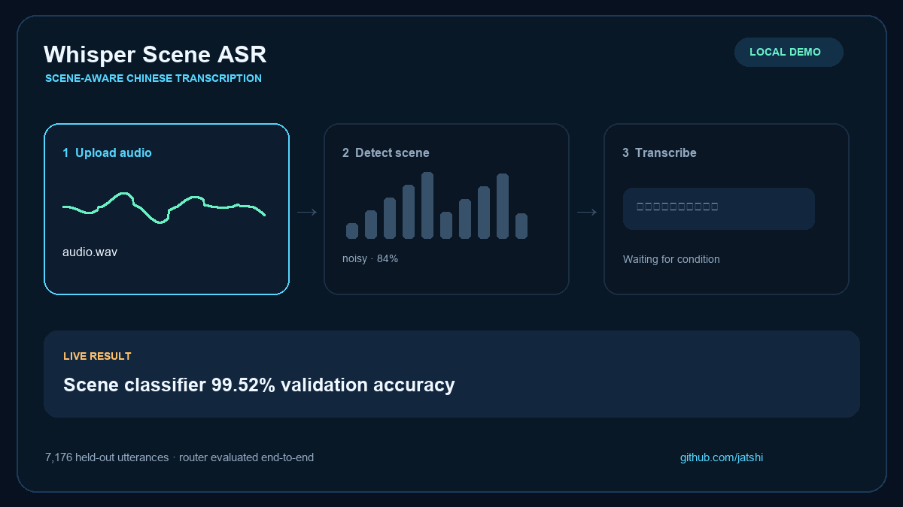
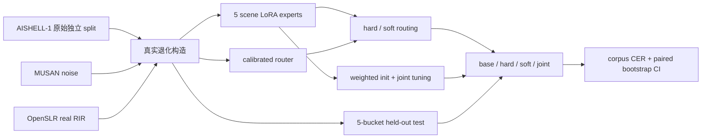

# Whisper Scene ASR v3

<p align="center">
  <strong>面向中文多声学场景的 Whisper-small + LoRA + 在线策略蒸馏工程</strong><br />
  真实退化数据 · 五专家路由 · OPD 后训练 · 安全回退 · 三随机种子评测
</p>

<p align="center">
  <a href="https://huggingface.co/jatshi/whisper-scene-asr/tree/main/v2"></a>
  <a href="https://huggingface.co/jatshi/whisper-scene-asr/tree/main/v3-opd-validation"></a>
  <a href="https://github.com/Jatshi/whisper-scene-asr/actions"></a>
  
  
</p>



> **状态：v2 完整链路已跑通。** AutoDL 上完成了数据构建、GPU smoke、五个场景 LoRA、校准路由器、联合 LoRA、5,000 条四系统评测、2,000 次配对 bootstrap 和制品打包。这里报告的是 AISHELL-1 派生五场景测试集结果，不外推为任意真实环境或 SOTA 结论。

> **v3 OPD 验证实验已完成。** 在 RTX 3080 Ti 上完成 3 seed × 2 轮在线收集/更新、真实 CER oracle、FKL/RKL、top-k、独立阈值校准和 paired bootstrap。结果严格标为 `validation_only`：测试使用 500 条五场景等额分层子集，不冒充完整 5,000 条正式结论。详见 [v3 OPD 结果](docs/RESULTS_V3_OPD.md)。

## 一眼看懂结果

| 系统 | Overall CER ↓ | 相对 base 的绝对变化 | 95% CI |
|---|---:|---:|---:|
| Whisper-small base | 40.41% | — | — |
| Hard routed expert | 17.17% | -23.24 pp | [-27.32, -19.93] pp |
| Soft routed fusion | 19.35% | -21.06 pp | [-25.12, -17.44] pp |
| **Joint LoRA** | **15.05%** | **-25.36 pp** | **[-29.39, -22.08] pp** |

评测共 5,000 条，每个场景 1,000 条；CER 按全语料总编辑数 / 总参考字符数计算。Joint LoRA 在 overall 以及 clean、noisy、reverb、noisy+reverb 四桶最优；fast/slow 桶中 soft routing 为 16.19%，略优于 hard 的 16.23% 和 joint 的 16.53%。因此不能把“soft 一定优于 hard”写成结论。

| 场景 | Base | Hard | Soft | Joint |
|---|---:|---:|---:|---:|
| clean | 28.22% | 12.00% | 13.99% | **8.75%** |
| noisy | 31.11% | 15.14% | 16.89% | **12.50%** |
| reverb | 29.97% | 14.38% | 15.64% | **11.59%** |
| fast / slow | 54.39% | 16.23% | **16.19%** | 16.53% |
| noisy + reverb | 58.35% | 28.10% | 34.05% | **25.88%** |

路由器验证准确率为 **88.84%**，温度缩放后 ECE 为 **1.20%**；推理时 11.44% 的低置信样本回退到 base。完整数字、统计边界和逐桶结果见 [v2 实验结果](docs/RESULTS_V2.md)。

### v3 OPD 验证结果

v3 在同一 500 条分层子集上的 base CER 为 33.961%。固定门槛过度保守，hard/soft 平均 CER 仅降至 33.818%/33.814%，平均回退率 99.6%。用独立 250 条 calibration split 选择门槛后：

| v3 变体 | Hard CER（3-seed mean ± SD） | Soft CER（3-seed mean ± SD） | 平均回退率 |
|---|---:|---:|---:|
| 固定门槛 | 33.818% ± 0.146% | 33.814% ± 0.153% | 99.6% |
| 校准门槛 | **32.350% ± 0.777%** | 36.008% ± 3.401% | 92.8% |

校准 hard 相对同子集 base 平均降低 **1.612 个百分点**，三个 seed 的 paired-bootstrap 胜出概率均为 1.000；soft 融合却不稳定。Offline-RKL 在三个 seed 上均塌缩为 100% 回退。它们是可复现的工程结论，不是被隐藏的失败结果。v3 与 v2 使用不同评测规模，且当前 v3 数值没有超过 v2 routed expert，不能混成同一排行榜。

## 为什么做这个项目

通用 ASR 在纯净、噪声、混响、语速变化等条件下的错误模式不同。单一模型继续盲目微调，容易把场景差异揉进一个不可解释的平均解。v2 保留冻结的 Whisper-small 主干，让五个 LoRA 专家学习不同退化条件，再比较三种决策方式：

1. **Hard**：选择路由概率最高的专家；证据不足就回退 base。
2. **Soft**：对 top-2 专家做稀疏加权融合，并用有界 LRU 缓存融合 adapter。
3. **Joint**：以专家融合为初始化，在五场景混合训练集上继续联合微调。

项目重点不是堆出一个 Demo，而是让每个结论都能回到数据 split、逐条预测、编辑数、置信区间、运行环境和文件哈希。



## v2 工程能力

- 真实 MUSAN 噪声、OpenSLR 真实 RIR、保音高 time-stretch，并逐样本记录退化来源与参数。
- AISHELL train / validation / test 独立构建，按 `source_id` 强制验重，报告 `source_disjoint=true`。
- 五个场景专家、一次 encoder 特征的轻量 MLP 路由器、温度校准、ECE、混淆矩阵。
- 低置信 / 高熵回退、top-2 稀疏 soft 权重、有界 adapter 缓存与显式淘汰。
- base / hard / soft / joint 四路逐条预测；语料级 CER、场景分桶、配对 bootstrap 95% CI。
- 13-stage 可恢复 AutoDL 流水线、训练请求指纹、checkpoint 续训、GPU smoke、SHA-256 运行清单。

## 快速开始

```bash
git clone https://github.com/Jatshi/whisper-scene-asr.git
cd whisper-scene-asr
python -m venv .venv
source .venv/bin/activate  # Windows: .venv\Scripts\activate
pip install -r requirements.txt
```

从 [Hugging Face v2](https://huggingface.co/jatshi/whisper-scene-asr/tree/main/v2) 下载部署 adapter 与路由器；Whisper-small 基座由 Transformers 首次运行时下载。设置产物路径后启动本地界面：

```bash
python app.py
# http://127.0.0.1:7860
```

完整 AutoDL 复现实验：

```bash
cd /root/autodl-tmp/whisper-scene-asr
bash scripts/run_autodl_v2.sh
```

流水线把 marker 写入 `output/v2/stages/*.done`，中断后重跑会跳过已成功阶段；训练器会恢复最近的 `checkpoint-*`。配置变化时请求指纹会阻止不兼容续跑。

## 本地质量检查

```bash
python -m ruff check .
python -m compileall -q src app.py
python -m pytest -q
```

当前 v3 OPD 分支：**40 tests passed**。真实 `openai/whisper-small`、五个 LoRA 专家、Oracle 标注、两轮 OPD 更新、三 seed 评测、消融、聚合和 SHA-256 运行清单已在 RTX 3080 Ti 12GB 上端到端通过。验证实验共运行 10.20 小时，生成 30,000 条在线 annotations；完整本地输出为 188 个文件、1.24GB。

## 产物与发布

| 位置 | 内容 |
|---|---|
| GitHub `results/` | 可审计的小型汇总结果、路由指标、GPU smoke 和运行清单 |
| [Hugging Face `v2/`](https://huggingface.co/jatshi/whisper-scene-asr/tree/main/v2) | 五专家 adapter、joint 部署 adapter、路由器和完整可移植包 |
| [Hugging Face `v3-opd-validation/`](https://huggingface.co/jatshi/whisper-scene-asr/tree/main/v3-opd-validation) | 三 seed OPD 策略权重、训练摘要、评测摘要与运行清单 |
| 本地 `output/v2/` | 324 个完整实验文件，含 checkpoint、逐条评测与全部中间产物 |
| 本地 `output/v3-opd-validation/` | 188 个完整实验文件，含 annotations、逐条评测、日志、遥测与全部策略权重 |

主要文件：

- `evaluation.csv`：5,000 条四路预测、路由决策与编辑数。
- `evaluation.summary.json`：overall / 五场景 CER 与配对 bootstrap。
- `scene_classifier.pt`、`router_metrics.json`：校准路由器及指标。
- `joint/deploy/joint/`：joint 部署 LoRA。
- `run_manifest.json`：环境、数据、指标和关键文件 SHA-256。
- `whisper-scene-asr-v2.tar.gz`：排除 checkpoint/cache 的 347.78MB 可移植包。
- `results/v3-opd-validation/run_manifest.json`：v3 验证运行的环境、状态和 163 个制品哈希。
- `results/v3-opd-validation/multiseed_summary.json`：三 seed 固定门槛主结果。

## 文档导航

- [v2 实验结果、统计解释与结论边界](docs/RESULTS_V2.md)
- [v3 OPD 验证结果、消融与声明边界](docs/RESULTS_V3_OPD.md)
- [v3 AutoDL 最终执行记录与踩坑](docs/AUTODL_EXECUTION_STATUS_V3_OPD.md)
- [完整链路踩坑、根因和修复](docs/TROUBLESHOOTING_V2.md)
- [实现与验收追踪](docs/IMPLEMENTATION_AND_ACCEPTANCE.md)
- [AutoDL 运行手册](docs/AUTODL_RUNBOOK.md)
- [实验协议](docs/EXPERIMENT_PROTOCOL.md)
- [数据与许可证](docs/DATA_AND_LICENSES.md)
- [可说与不可说的声明边界](docs/CLAIM_BOUNDARY.md)

## 结论边界

本次结果支持“在固定的 AISHELL-1 派生五场景测试协议下，joint LoRA 的 CER 低于同次 base，且配对 bootstrap 区间不跨 0”。它**不支持**“任意真实噪声中都有效”“超过公开 SOTA”“soft routing 总是优于 hard”或“已经完成生产部署”。更强结论仍需真实录音、多数据集、跨设备、跨 seed 与延迟/吞吐评测。

## License

代码采用 MIT License；Whisper、AISHELL-1、MUSAN 与 OpenSLR RIRS 保留各自许可证和使用条款。
